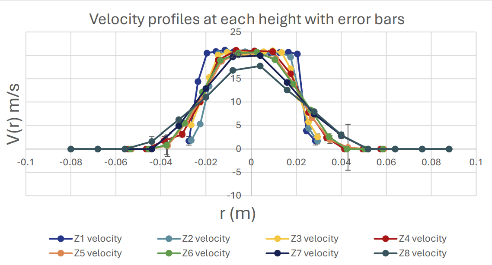
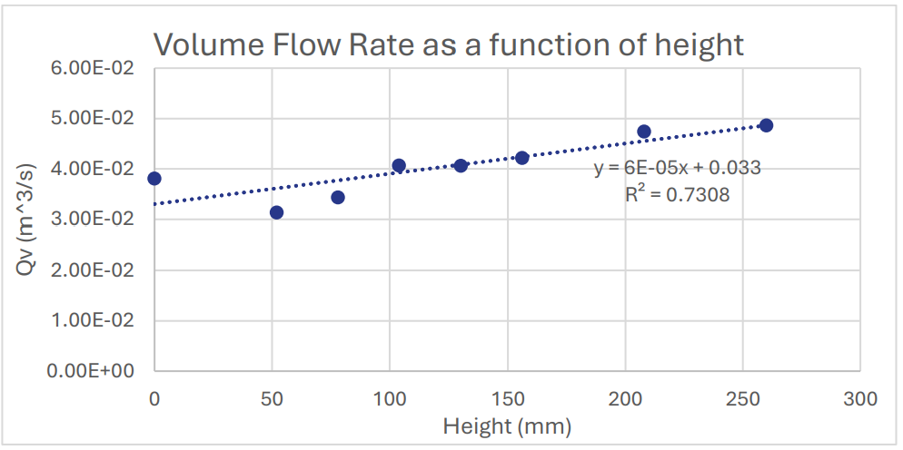
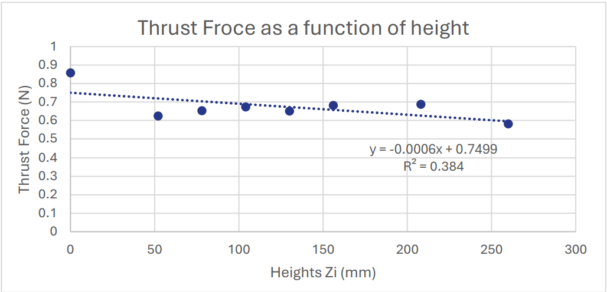

# Free Jet Fluid Dynamics Experiment

Experimental investigation of a free air jet conducted in the Fluid Mechanics Laboratory at BME. The objective of the experiment was to analyze the velocity distribution, volume flow rate, and development of a free jet using Pitot-static measurements.

## Experimental Results

### Velocity Profiles

<p align="center">
  
</p>

### Volume Flow Rate vs Height

<p align="center">
  
</p>

### Thrust vs Height

<p align="center">
  
</p>
In this experiment, the velocity profile of a free air jet was measured at different downstream heights from the nozzle. Dynamic pressure measurements were obtained using a Pitot-static tube connected to a digital manometer, and the flow characteristics were evaluated through data processing and analysis.

The experiment demonstrates key principles of fluid mechanics including jet development, velocity decay, and measurement uncertainty.

## My Role

Lab Leader

Responsibilities:
- Coordinated the experimental procedure
- Supervised the measurement setup
- Assisted team members with instrument calibration
- Ensured correct data acquisition during the experiment
- Led data processing and verification of results

## Experimental Setup

The laboratory setup consisted of:

- Air jet nozzle connected to a fan system
- Fan speed controller
- Pitot-static tube mounted on an adjustable stand
- Digital manometer
- Betz manometer for calibration

The velocity profile was measured at multiple downstream positions relative to the nozzle diameter.

## Methodology

The experiment included the following steps:

1. Measurement of atmospheric pressure and temperature to determine air density
2. Calibration of the digital manometer using a Betz manometer
3. Determination of the outlet velocity based on dynamic pressure
4. Measurement of velocity profiles at several heights of the jet
5. Data processing using Excel to calculate velocity distribution and flow properties
6. Error analysis using Gaussian error propagation

## Key Calculations

Velocity from dynamic pressure:

v = sqrt(2 * p_dyn / rho)

Air density:

rho = p0 / (R * T0)

where:

p_dyn – dynamic pressure  
rho – air density  
p0 – atmospheric pressure  
T0 – ambient temperature  
R – specific gas constant of air

## Results

The experiment produced several key observations:

- Velocity is highest at the center of the jet and decreases toward the edges.
- Maximum velocity decreases with increasing distance from the nozzle.
- The jet spreads as it moves downstream, increasing the effective flow area.
- Thrust force decreases with height due to the reduction in velocity.
```
## Repository Structure

free-jet-fluid-dynamics-experiment
│
├── report
│   └── Lab_M02_Report.pdf
│
├── data
│   └── Lab_M02_excel.xlsx
│
└── figures
    └── velocity_profiles.png
```

## Skills Demonstrated

- Experimental Fluid Mechanics
- Pitot-static measurements
- Instrument calibration
- Data analysis in Excel
- Uncertainty analysis
- Engineering report writing

## Author

Mechanical Engineering Student  
CAD | FEM | MATLAB | Python | Manufacturing
